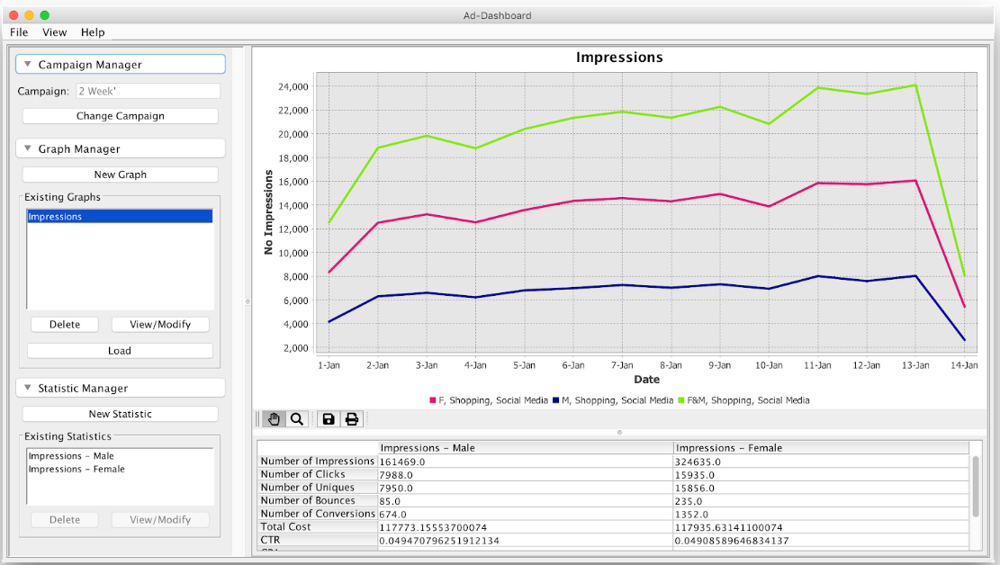

# Ad Auction Dashboard - Group 33

The Ad Auction Dashboard is an application that is used for easier evaluation of custom made campaigns.
The project is developed using Agile methodologies and it is separated into 3 Increments. 




## Functionality
The Ad Auction Dashboard Project was completed in the span of three sprints. It has all the functionality that we promised to deliver in the three sprint backlogs,
as well as additional features that were agreed upon with our client.

Some of the features of the application are:
* Create a Workspace
* Select from a list of already existing workspaces
* Modify existing workspaces
* Upload a new campaign 
* Load a already uploaded campaign
* Create custom graph
    * Configure chart background colour, title, x and y axis labels 
* View a metric line graph
    * Select amongst all key metrics (e.g. Number of Impressions, Number of Bounces, CTR, CPA, etc.)
    * Configure time interval (hour, day, week, month, or year)
    * Filter data by age, income, context, gender, date range
* Customise line
    * Configure line name, colour, thickness
* Add multiple lines on a single graph 
    * Compare audience segments
    * Compare data from different ranges 
        * Overlay/Normal options available
        * Compare data from a specific time within the day
        * Compare data from a specific day
* Generate a click cost histogram
* Compare data for multiple campaigns 

## Getting Started
The instructions below will guide you through the steps for running the code.

### Prerequisites
Make sure you have ``postgres`` installed. If not follow these steps:
* Go to [PostgreSQL website](https://www.postgresql.org/download/) and install the latest version available for your system.
    * If you have ``apt`` on your system you can run:
    ```bash
    sudo apt install postgresql
    ```
    
* After installation, set up a *username* and *password* for your account with the correct permissions:
    * Open a terminal as the system user **postgres** and use the command: 
    ``` bash
    psql postgres
    ```
    to run postgres as admin.
    * To create user, use:
    ```SQL
    CREATE ROLE <DB_USER> WITH LOGIN PASSWORD <DB_PASSWORD>;
    ```
    * To give your user database creation permissions, use: 
    ``` SQL
    ALTER ROLE <username> CREATEDB;
    ```
    * Quit postgres and run:
    ``` bash
    psql  -U <DB_USER>
    ```
* Once you enter your password run the command below to create the database for importing:
````SQL
CREATE DATABASE <DB_NAME>;
````

### Running the application

   * To build from source by running: ``mvn install`` 
       * This will create a jar called ad-auction-1.0-SNAPSHOT.jar in the target folder.
   * Make sure that the *username* and *password* you used when installing postgres are added to the corresponding fields in the ``config.properties`` file in the SEG directory, following the setup:
       
        ```
        DB_HOST = jdbc:postgresql://localhost:5432/DB_NAME
        DB_USER = DB_USER
        DB_PASSWORD = DB_PASSWORD
        ```
        
       * By default the postgres server is listening on port 5432, so DB_HOST should be `` jdbc:postgresql://localhost:5432/DBNAME ``, where DBNAME is the name you’ve selected for the database.

   * Make sure that the ``config.properties`` file is in the same folder as the .jar file.
   * Execute the *.jar* file by running: ``java -jar SEG.jar``
   
###Running the tests
   
   * To run the tests use ``mvn test`` (You should have Maven installed)
   
## Built With
* [TravisCI](http://www.dropwizard.io/1.0.2/docs/) - Distributed Continuous Integration Service
* [Maven](https://maven.apache.org/) - Dependency Management
* [Mockito](http://site.mockito.org/) - Mocking Framework
* [JUnit](https://junit.org/junit5/) - Testing Framework

