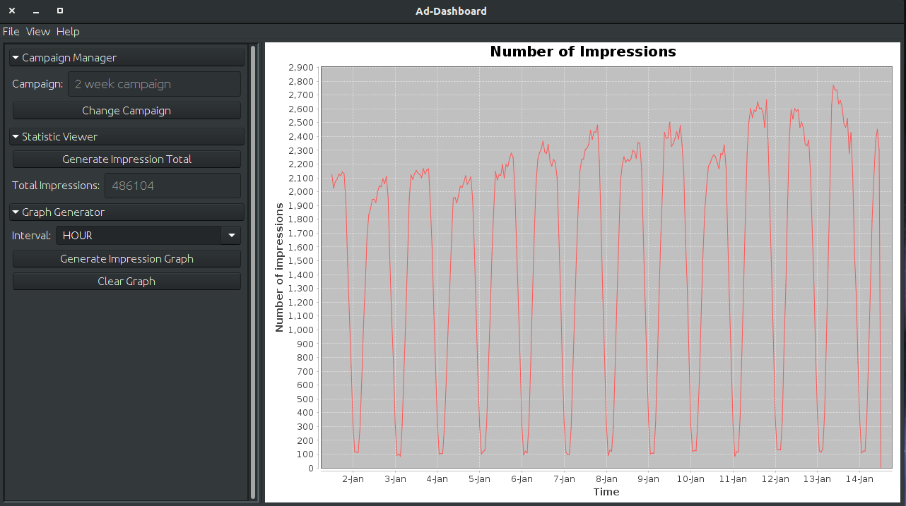

# Ad Auction Dashboard - Group 33

The Ad Auction Dashboard is an application that will be used for easier evaluation of custom made campaigns.
The project is developed using Agile methodologies and it is separated into 3 Increments. 




##Functionality
The project is currently under development and it has the functionality that we promised to deliver in **Sprint One** and **Sprint Two** Backlogs.
Currently a user of the system is able to see all key metrics as total statistics and as a graph. Other functionality the application supports includes:
* Upload a new campaign 
* Select from a list of already uploaded campaigns
* Create custom graph, x and y axis name 
* Customise line name, colour, thickness
* Add multiple lines on a single graph 
* Filter data by age, income, context, gender, date range
* Generate data for specific intervals (minute, hour, day, week, or month)

##Future Development
In **Sprint Three** backlog we have the rest of the user stories that we have not delivered in the previous two sprints.
The features we are intending to include are:
* Click costs histogram
* Comparing audience segments
* Comparing data from different campaigns
* Time of day statistics
* Specific day statistics
* Colour change option

## Getting Started
The instructions below will guide you through the steps for running the code.

### Prerequisites
Make sure you have ``postgres`` installed. If not follow these steps:
* Go to [PostgreSQL website](https://www.postgresql.org/download/) and install the latest version available for your system.
    * If you have ``apt`` on your system you can run:
    ```bash
    sudo apt install postgresql
    ```
    
* After installation, set up a *username* and *password* for your account with the correct permissions:
    * Open a terminal as the system user **postgres** and use the command: 
    ``` bash
    psql postgres
    ```
    to run postgres as admin.
    * To create user, use:
    ```SQL
    CREATE ROLE <DB_USER> WITH LOGIN PASSWORD <DB_PASSWORD>;
    ```
    * To give your user database creation permissions, use: 
    ``` SQL
    ALTER ROLE <username> CREATEDB;
    ```
    * Quit postgres and run:
    ``` bash
    psql  -U <DB_USER>
    ```
* Once you enter your password run the command below to create the database for importing:
````SQL
CREATE DATABASE <DB_NAME>;
````

### Running the application

   * To build from source by running: ``mvn install`` 
       * This will create a jar called ad-auction-1.0-SNAPSHOT.jar in the target folder.
   * Make sure that the *username* and *password* you used when installing postgres are added to the corresponding fields in the ``config.properties`` file in the SEG directory, following the setup:
       
        ```
        DB_HOST = jdbc:postgresql://localhost:5432/DB_NAME
        DB_USER = DB_USER
        DB_PASSWORD = DB_PASSWORD
        ```
        
       * By default the postgres server is listening on port 5432, so DB_HOST should be `` jdbc:postgresql://localhost:5432/DBNAME ``, where DBNAME is the name you’ve selected for the database.

   * Make sure that the ``config.properties`` file is in the same folder as the .jar file.
   * Execute the *.jar* file by running: ``java -jar SEG.jar``

## Built With
* [TravisCI](http://www.dropwizard.io/1.0.2/docs/) - Distributed Continuous Integration Service
* [Maven](https://maven.apache.org/) - Dependency Management
* [Mockito](http://site.mockito.org/) - Mocking Framework
* [JUnit](https://junit.org/junit5/) - Testing Framework

